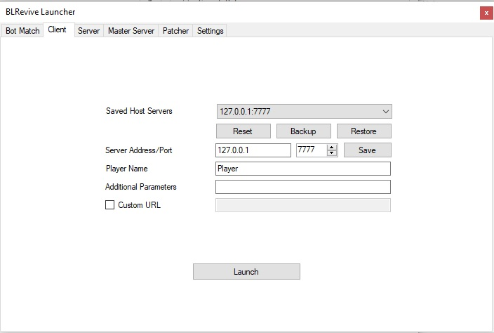

A simple GUI wrapper for patching and launching Blacklight: Retribution v3.02.

## usage

For usage instructions, see [Wiki/Installing & Using BLRevive](https://gitlab.com/blrevive/blrevive/-/wikis/Installing-&-Using-BLRevive).

## development

### prerequisites

- Visual Studio 2019
- C#
- .NET Framework 4+

### setup environment

- clone BLRevive `git clone --recursive git@gitlab.com:blrevive/blrevive`

- open solution with VS2019
- set Launcher as solution build target

- double check that nuget packages are installed

> Note that for testing all launcher features you have to build the whole solution, since it depends on Patcher & Proxy.

#### install dependencies

- Newtonsoft.Json
- Serilog